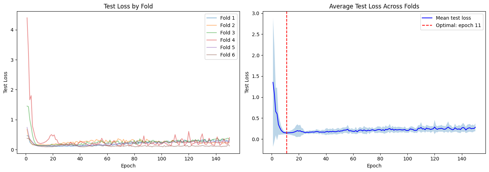
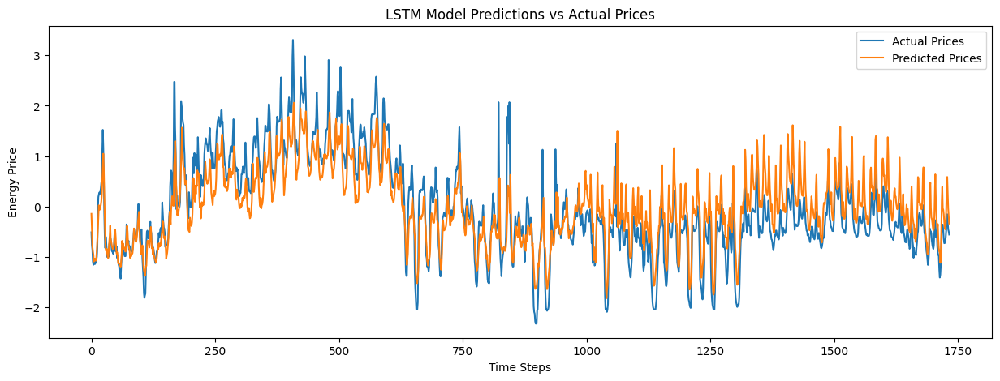

==================================================
Fold 1/6: Train → 2022-06
==================================================
  Epoch 25: test_loss = 0.1072
  Epoch 50: test_loss = 0.1356
  Epoch 75: test_loss = 0.1939
  Epoch 100: test_loss = 0.1987
  Epoch 125: test_loss = 0.2975
  Epoch 150: test_loss = 0.3013

==================================================
Fold 2/6: Train → 2022-07
==================================================
  Epoch 25: test_loss = 0.1743
  Epoch 50: test_loss = 0.2808
  Epoch 75: test_loss = 0.2531
  Epoch 100: test_loss = 0.2257
  Epoch 125: test_loss = 0.2538
  Epoch 150: test_loss = 0.2325

==================================================
Fold 3/6: Train → 2022-08
==================================================
  Epoch 25: test_loss = 0.1641
  Epoch 50: test_loss = 0.2270
  Epoch 75: test_loss = 0.2401
  Epoch 100: test_loss = 0.2577
  Epoch 125: test_loss = 0.3375
  Epoch 150: test_loss = 0.3407

==================================================
Fold 4/6: Train → 2022-09
==================================================
  Epoch 25: test_loss = 0.1968
  Epoch 50: test_loss = 0.1730
  Epoch 75: test_loss = 0.2258
  Epoch 100: test_loss = 0.1848
  Epoch 125: test_loss = 0.3139
  Epoch 150: test_loss = 0.3999

==================================================
Fold 5/6: Train → 2022-10
==================================================
  Epoch 25: test_loss = 0.1335
  Epoch 50: test_loss = 0.1551
  Epoch 75: test_loss = 0.2186
  Epoch 100: test_loss = 0.2372
  Epoch 125: test_loss = 0.2216
  Epoch 150: test_loss = 0.2779

==================================================
Fold 6/6: Train → 2022-11
==================================================
  Epoch 25: test_loss = 0.1386
  Epoch 50: test_loss = 0.1263
  Epoch 75: test_loss = 0.1481
  Epoch 100: test_loss = 0.1097
  Epoch 125: test_loss = 0.1116
  Epoch 150: test_loss = 0.1263

CV training complete!

Optimal epoch: 11 (0-indexed: 10)
Average test loss at optimal: 0.1443 (± 0.0317)

Eval on test set (pred vs true):

