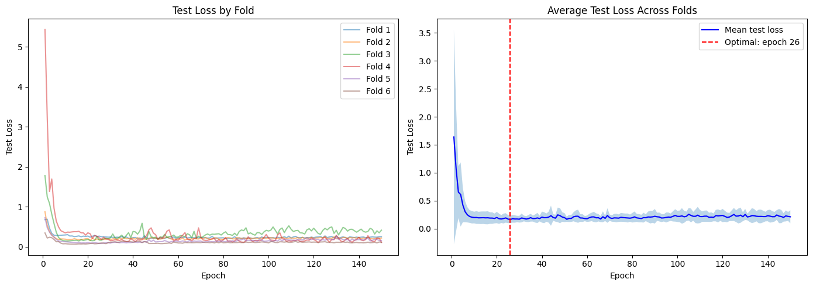
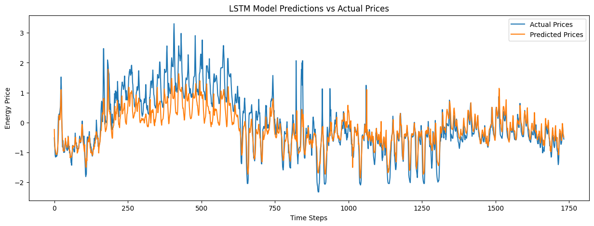

# Fold 1/6: Train → 2022-06
  Epoch 25: test_loss = 0.2686
  
  Epoch 50: test_loss = 0.2131
  
  Epoch 75: test_loss = 0.2660
  
  Epoch 100: test_loss = 0.2349
  
  Epoch 125: test_loss = 0.2744
  
  Epoch 150: test_loss = 0.2552

# Fold 2/6: Train → 2022-07
  Epoch 25: test_loss = 0.1855
  
  Epoch 50: test_loss = 0.2232
  
  Epoch 75: test_loss = 0.1891
  
  Epoch 100: test_loss = 0.2247
  
  Epoch 125: test_loss = 0.2548
  
  Epoch 150: test_loss = 0.2207

# Fold 3/6: Train → 2022-08
  Epoch 25: test_loss = 0.1705
  
  Epoch 50: test_loss = 0.2415
  
  Epoch 75: test_loss = 0.3185
  
  Epoch 100: test_loss = 0.3961
  
  Epoch 125: test_loss = 0.4633
  
  Epoch 150: test_loss = 0.4180

# Fold 4/6: Train → 2022-09
  Epoch 25: test_loss = 0.2280
  
  Epoch 50: test_loss = 0.3050
  
  Epoch 75: test_loss = 0.2052
  
  Epoch 100: test_loss = 0.2164
  
  Epoch 125: test_loss = 0.2416
  
  Epoch 150: test_loss = 0.1142

# Fold 5/6: Train → 2022-10

  Epoch 25: test_loss = 0.0878
  
  Epoch 50: test_loss = 0.1219
  
  Epoch 75: test_loss = 0.1277
  
  Epoch 100: test_loss = 0.1541
  
  Epoch 125: test_loss = 0.1634
  
  Epoch 150: test_loss = 0.1563

# Fold 6/6: Train → 2022-11
  Epoch 25: test_loss = 0.0908
  
  Epoch 50: test_loss = 0.0872
  
  Epoch 75: test_loss = 0.1144
  
  Epoch 100: test_loss = 0.0994
  
  Epoch 125: test_loss = 0.1296
  
  Epoch 150: test_loss = 0.1136

CV training complete!

Optimal epoch: 26 (0-indexed: 25)
Average test loss at optimal: 0.1640 (± 0.0627)

__